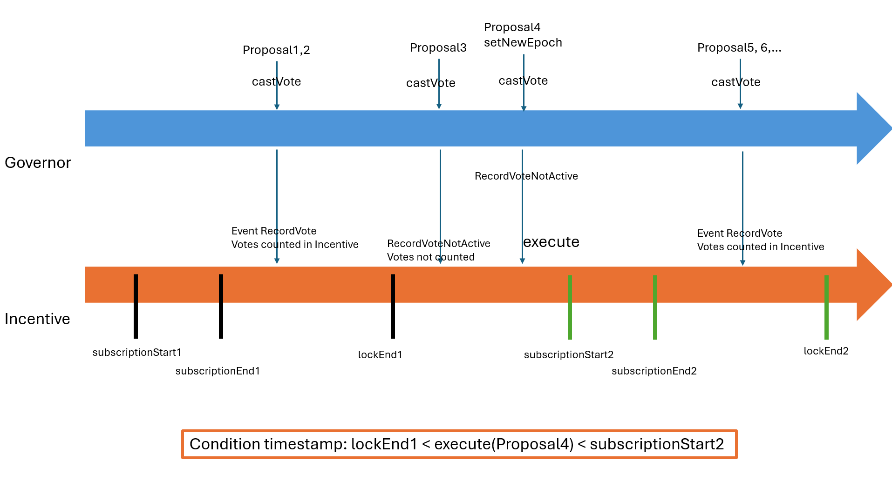

# REGGovernor Contract Documentation

## Overview

The `REGGovernor` contract is a governance contract that extends OpenZeppelin's Governor contracts to manage proposals and voting within a decentralized organization. It introduces additional features such as customizable proposer requirements, integration with an incentive vault for rewarding voter participation, and enhanced access control mechanisms.

## Inheritance

The `REGGovernor` contract inherits from multiple OpenZeppelin upgradeable contracts and implements the `IREGGovernor` interface:

- **Inheritance:**

- **`GovernorUpgradeable`**: Core governance logic from OpenZeppelin.
- **`GovernorSettingsUpgradeable`**: Manages voting delay, voting period, and proposal thresholds.
- **`GovernorCountingSimpleUpgradeable`**: Implements simple counting for "For," "Against," and "Abstain" votes.
- **`GovernorVotesUpgradeable`**: Integrates voting power based on a token (IVotes).
- **`GovernorVotesQuorumFractionUpgradeable`**: Handles quorum based on a fraction of the total supply of tokens.
- **`GovernorTimelockControlUpgradeable`**: Adds support for timelock functionality to delay the execution of proposals.
- **`AccessControlUpgradeable`**: Manages roles and access control for different functions.
- **`UUPSUpgradeable`**: Provides the ability to upgrade the contract using the UUPS proxy pattern.

## Key Features

- **Custom Proposer Modes:** Allows the governance to define who can create proposals based on roles and/or voting power.
- **Incentive Integration:** Optionally records votes in an incentive vault (`IREGIncentiveVault`) to reward voter participation.
- **Access Control:** Utilizes role-based access control to manage permissions for proposing, upgrading, and cancelling proposals.
- **Upgradeable Contract:** Implements UUPS (Universal Upgradeable Proxy Standard) pattern for contract upgradeability.

## Roles and Permissions

- **DEFAULT_ADMIN_ROLE:** Has full control over the contract, including granting and revoking other roles.
- **UPGRADER_ROLE:** Authorized to upgrade the contract's implementation.
- **PROPOSER_ROLE:** Granted to addresses allowed to create proposals when certain proposer modes are active.
- **CANCELLER_ROLE:** Granted to addresses that can cancel proposals.

## Initialization

```solidity
function initialize(
    IVotes _token,
    TimelockControllerUpgradeable _timelock,
    address defaultAdmin
) public initializer
```

- **Description:** Initializes the contract with the necessary parameters and roles.
- **Parameters:**
  - `_token`: The governance token implementing the `IVotes` interface.
  - `_timelock`: The address of the timelock controller contract.
  - `defaultAdmin`: The address that will have the `DEFAULT_ADMIN_ROLE` and `UPGRADER_ROLE`.
- **Initial Settings:**
  - **Voting Delay:** 1 day.
  - **Voting Period:** 7 days.
  - **Proposal Threshold:** 100 tokens (assuming 18 decimals).
  - **Quorum Fraction:** 5% of the total token supply.

## Proposer Modes

The contract introduces a `ProposerMode` enumeration to define who is allowed to create proposals:

- **Modes:**
  - `ProposerWithRole`: Only addresses with the `PROPOSER_ROLE` can propose.
  - `ProposerWithVotingPower`: Only addresses with voting power above the proposal threshold can propose.
  - `ProposerWithRoleAndVotingPower`: Only addresses with both the `PROPOSER_ROLE` and sufficient voting power can propose.
  - `ProposerWithRoleOrVotingPower`: Addresses with either the `PROPOSER_ROLE` or sufficient voting power can propose.

## Functions

### Administrative Functions

#### Set Proposer Mode

```solidity
function setProposerMode(ProposerMode proposerMode) external override onlyGovernance
```

- **Description:** Sets the proposer mode to control who can create proposals.
- **Access Control:** Can only be called through a successful governance proposal (`onlyGovernance`).

#### Set Incentive Enabled

```solidity
function setIncentiveEnabled(bool status) external override onlyGovernance
```

- **Description:** Enables or disables the recording of votes in the incentive vault.
- **Access Control:** Can only be called through a successful governance proposal.

#### Set Incentive Vault

```solidity
function setRegIncentiveVault(IREGIncentiveVault regIncentiveVault) external override onlyGovernance
```

- **Description:** Sets the address of the incentive vault contract.
- **Access Control:** Can only be called through a successful governance proposal.

#### Cancel by Admin

```solidity
function cancelByAdmin(
    address[] memory targets,
    uint256[] memory values,
    bytes[] memory calldatas,
    bytes32 descriptionHash
) external override onlyRole(CANCELLER_ROLE) returns (uint256)
```

- **Description:** Allows an address with the `CANCELLER_ROLE` to cancel a proposal.
- **Access Control:** Restricted to addresses with the `CANCELLER_ROLE`.

### Getter Functions

#### Get Proposer Mode

```solidity
function getProposerMode() external view override returns (ProposerMode)
```

- **Description:** Returns the current proposer mode.

#### Get Incentive Enabled Status

```solidity
function getIncentiveEnabled() external view override returns (bool)
```

- **Description:** Indicates whether the incentive recording is enabled.

#### Get Incentive Vault Address

```solidity
function getRegIncentiveVault() external view override returns (IREGIncentiveVault)
```

- **Description:** Returns the address of the incentive vault contract.

### Proposal Functions

#### Propose

```solidity
function propose(
    address[] memory targets,
    uint256[] memory values,
    bytes[] memory calldatas,
    string memory description
) public override returns (uint256)
```

- **Description:** Creates a new proposal after verifying that the proposer meets the requirements based on the current proposer mode.
- **Custom Logic:**
  - **Role and Voting Power Checks:** Verifies if the proposer has the necessary role and/or voting power.
  - **Description Hash Event:** Emits an additional event `ProposalCreatedDescriptionHash` with the hash of the proposal description for easier tracking.
- **Reverts:**
  - If the proposer does not meet the requirements of the current proposer mode.

### Voting Functions

#### \_castVote (Internal)

```solidity
function _castVote(
    uint256 proposalId,
    address account,
    uint8 support,
    string memory reason,
    bytes memory params
) internal override returns (uint256)
```

- **Description:** Records a vote for a proposal. If incentive recording is enabled, it also records the vote in the incentive vault.
- **Custom Logic:**
  - Checks if `_incentiveEnabled` is `true`.
  - Calls `_regIncentiveVault.recordVote(account, proposalId)` to record the vote.

### Upgrade Function

#### \_authorizeUpgrade (Internal)

```solidity
function _authorizeUpgrade(address newImplementation) internal override onlyRole(UPGRADER_ROLE)
```

- **Description:** Authorizes the contract upgrade to a new implementation.
- **Access Control:** Restricted to addresses with the `UPGRADER_ROLE`.

## Access Control

- **Roles:**

  - `DEFAULT_ADMIN_ROLE`: Manages other roles and can grant or revoke them.
  - `UPGRADER_ROLE`: Authorized to perform contract upgrades.
  - `PROPOSER_ROLE`: Authorized to create proposals under certain proposer modes.
  - `CANCELLER_ROLE`: Authorized to cancel proposals.

- **Role Assignment:**
  - Roles are assigned during initialization to the `defaultAdmin` address.
  - Additional role management can be performed by the `DEFAULT_ADMIN_ROLE`.

## Events

- **SetProposerMode(ProposerMode proposerMode):** Emitted when the proposer mode is changed.
- **SetIncentiveEnabled(bool status):** Emitted when the incentive recording status is changed.
- **SetRegIncentiveVault(IREGIncentiveVault regIncentiveVault):** Emitted when the incentive vault address is set.
- **ProposalCreatedDescriptionHash(bytes32 descriptionHash):** Emitted with the hash of the proposal description when a new proposal is created.

## Errors Handling

- **GovernorRestrictedProposer(address proposer):** Reverted when a proposer is restricted from creating a proposal due to invalid description content.
- **InvalidProposerWithRole():** Reverted when the proposer lacks the required `PROPOSER_ROLE`.
- **InvalidProposerWithVotingPower():** Reverted when the proposer lacks sufficient voting power.
- **InvalidProposerWithRoleAndVotingPower():** Reverted when the proposer lacks both the required role and sufficient voting power.
- **InvalidProposerWithRoleOrVotingPower():** Reverted when the proposer lacks both the required role and sufficient voting power, in a mode that requires either.
- **InvalidProposerMode():** Reverted when an invalid proposer mode is set.

## Integration with Incentive Vault

When the incentive feature is enabled, the contract interacts with an `IREGIncentiveVault` to record votes, which may be used to distribute incentives to active participants.

- **Enabling Incentives:**

  - Call `setIncentiveEnabled(true)` via a governance proposal.
  - Set the incentive vault address using `setRegIncentiveVault`.

- **Recording Votes:**
  - Upon casting a vote, if incentives are enabled, the contract records the vote in the incentive vault.
  - When the vote is recorded for the incentive periode, there is a RecordVote event in the transaction, else there is a RecordVoteNotActive event.
  - Only votes during an incentive lock period are counted for rewards as in the diagram below.


Image: Diagram for recording votes between REGGovernor and REGIncentiveVault contracts

## Conclusion

The `REGGovernor` contract extends OpenZeppelin's Governor contracts to provide a robust governance system with customizable proposer requirements, incentive integration, and strict access control. By leveraging OpenZeppelin's upgradeable patterns and implementing additional features, it offers flexibility and security for managing decentralized governance processes.

---

**Note to Users:** To interact with this contract, ensure that you understand the current proposer mode and your role within the governance system. When creating proposals or voting, be aware of any incentives that may be active and how they may affect your participation.
