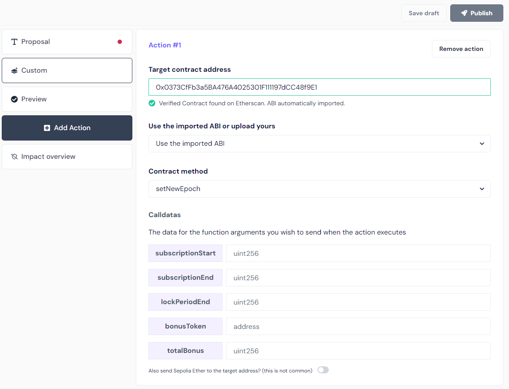

## REGGovernor: Activating a New Incentive Period

When creating a proposal to activate a new incentive period, the action within the proposal is to call the `setNewEpoch` function in the `REGIncentiveVault` contract:

```solidity
function setNewEpoch(
    uint256 subscriptionStart,
    uint256 subscriptionEnd,
    uint256 lockPeriodEnd,
    address bonusToken,
    uint256 totalBonus
) external onlyRole(DEFAULT_ADMIN_ROLE);
```



### Parameters:

- **subscriptionStart**: The timestamp when the subscription period begins.
- **subscriptionEnd**: The timestamp when the subscription period ends.
- **lockPeriodEnd**: The timestamp when the lock period ends.
- **bonusToken**: The address of the bonus token.
- **totalBonus**: The total amount of the bonus token in wei (18 decimals for WXDAI, 6 decimals for USDC).

### Conditions to Consider:

Ensure that the following condition is met:

```
Calling function timestamp < subscriptionStart < subscriptionEnd < lockPeriodEnd
```

### Delays in the REGGovernor Contract:

The `REGGovernor` contract imposes different delays on proposal actions, which vary between networks:

| Delay Type          | Sepolia            | Gnosis  |
| ------------------- | ------------------ | ------- |
| Proposal delay      | 15 minutes         | 1 day   |
| Voting period delay | 3 hours            | 7 days  |
| Queue delay         | 10 minutes         | 2 days  |
| **Total delay**     | 3 hours 25 minutes | 10 days |

### Ensuring Correct Subscription Start:

The `subscriptionStart` timestamp must be greater than the sum of the proposal creation timestamp and the combined delays:

```
subscriptionStart > (timestamp of proposal creation + proposal delay + voting period delay + queue delay)
```

This ensures that the proposal can pass and be executed before the `subscriptionStart` timestamp. For instance, on Sepolia:

- The `subscriptionStart` must be at least 3 hours and 25 minutes after the proposal creation timestamp.
- To account for any manual queue and execution actions, it's recommended to set `subscriptionStart` to a time greater than the proposal creation timestamp plus 4 hours (14400 seconds).

This gives sufficient time for all actions to be completed before the subscription period starts.
